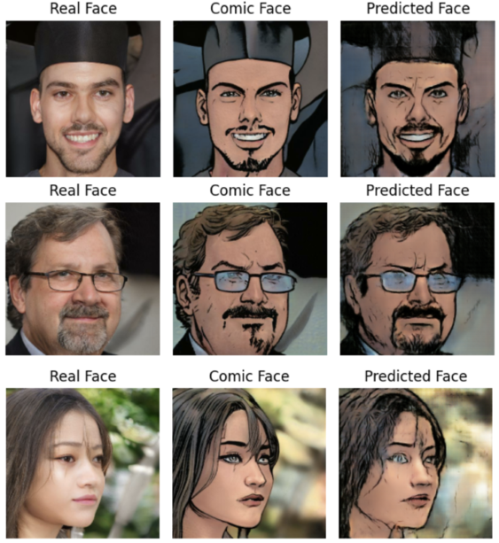

# Turn Your Photos Into A Comic Book

<a target="_blank" href="https://huggingface.co/spaces/kmnis/comicface.ai">
  
</a>

## Table of contents
1. [Directory Structure](#dir)
2. [Dataset](#dataset)
3. [Models](#models)
4. [Results](#results)

## Directory Structure <a name="dir"></a>

```graphql
./comicface-ai/*
  ├─ data - # The training dataset will go here. A few sample images are added for reference
  ├─ src - # Model architecture, data loading, and other utility scripts are saved here
  ├─ notebooks - # The notebooks show an end-to-end pipeline to train and infer the models. The notebook names are self-explanatory
  ├─ saved_models - # Trained models
```

## Dataset <a name="dataset"></a>
The dataset is sourced from [Kaggle](https://www.kaggle.com/datasets/defileroff/comic-faces-paired-synthetic-v2) and contains 10,000 pairs of faces and their comic version. Each image is of 1024x1024 dimensions.


## Models <a name="models"></a>
Two different model architectures are tried for training: Convolutional Variational Autoencoder and Pix2Pix GAN.

### Convolutional VAE

<table>
  <tr>
    <td>
      
      <p align="center"><em>Model Architecture</em></p>
    </td>
    <td>
      
      <p align="center"><em>Convolutional VAE Training</em></p>
    </td>
  </tr>
</table>

### Pix2Pix GAN

<table>
  <tr>
    <td>
      
      <p align="center"><em>Model Architecture</em></p>
    </td>
    <td>
      
      <p align="center"><em>Pix2Pix GAN Training</em></p>
    </td>
  </tr>
</table>

## Results <a name="results"></a>

<table>
  <tr>
    <td>
      
      <p align="center"><em>Convolutional VAE Sample Results</em></p>
    </td>
  </tr>
</table>

<table>
  <tr>
    <td>
      
      <p align="center"><em>Pix2Pix GAN Sample Results</em></p>
    </td>
  </tr>
</table>
